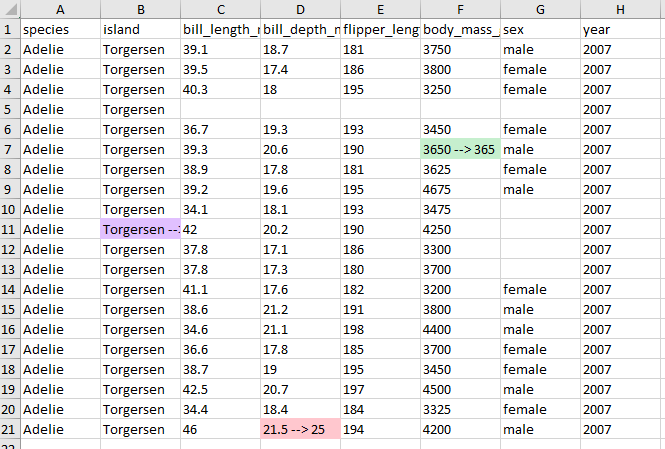
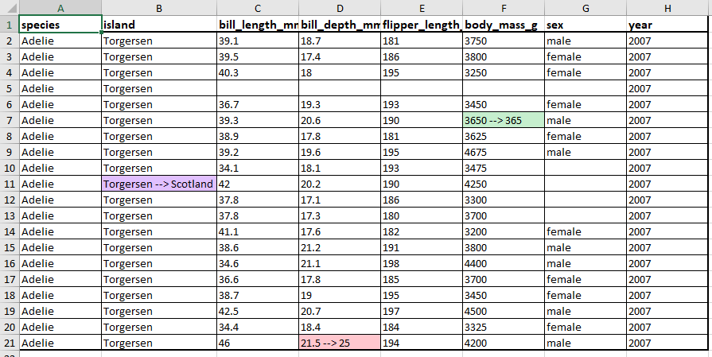

<!-- README.md is generated from README.Rmd. Please edit that file -->

# xldiff

<!-- badges: start -->
<!-- badges: end -->

The goal of xldiff is to facilitate comparing excel sheets to look for
changes, inspired by `diff` tools. `xldiff` was originally developed to
help compare inputs and outputs for different runs of the FRAM salmon
model, which stores both inputs and outputs in excel files. However, the
comparison tools here can be used more broadly to compare different
files with the same structure, for example monthly reports summarizing
survey information, service use, or finances.

## Installation

You can install the development version of xldiff like so:

``` r
remotes::install_github("cbedwards-dfw/xldiff")
#OR
# pak::pkg_install("cbedwards-dfw/xldiff")
```

## Example

### Creating our files

We can carry out simple comparisons of excel files with the
`excel_diff()` function. To begin with, we must have two excel sheets
that are generally similar, but for which some cells have differing
values. To walk through our example, we first must create two such excel
sheets. Here we use the first 20 rows of the `penguins` data in the
`palmerpenguins` package
(<https://allisonhorst.github.io/palmerpenguins/>).

``` r
library(palmerpenguins)
library(writexl)

# create our two data frames
dat1 = dat2 = penguins[1:20,]
## convert $island to character for easier modification
dat1$island = dat2$island = as.character(dat1$island)
## change several entries in dat2.
dat2$island[10] = "Scotland"
dat2$body_mass_g[6] = 365
dat2$bill_depth_mm[20] = 25


## write to excel files, in sheet named "penguins". See ?writexl::writexlsx.
write_xlsx(list(penguins = dat1),
           path = "example-penguins-1.xlsx")
write_xlsx(list(penguins = dat2),
           path = "example-penguins-2.xlsx")
```

### Basic example

With our two files in hand, we can use `excel_diff` to compare them:

``` r
library(xldiff)

excel_diff(file.1 = "example-penguins-1.xlsx",
          file.2 = "example-penguins-2.xlsx",
          results.name = "penguin-file-comparison.xlsx",
          sheet.name = "penguins"
)
```

This produces an excel file that shows and highlights changes in cells.



### Adding formatting

We already have the key results from `xldiff`: an excel file that
identifies changed cells and lists the values of the first file and the
second file. However, aside from the highlighting to flag changed cells,
the rest of the document lacks formatting. Particularly with more
complex spreadsheets (e.g. the FRAM input and outputs that `xldiff` was
developed for), it can be easier to contextualize changes if the “diff”
file has formatting. `excel_diff()` supports this with the optional
argument `extra_format_fun`. `xldiff` uses the `openxlsx` package to
handle excel file formatting, and `extra_format_fun` should be a
user-created function which applies excel formatting using the functions
of `openxlsx` (commonly `createStyle`, `addStyle`, `setColWidths` and
`setRowHeights`). The first two arguments of `extra_format_fun` must be
the workbook object and sheet name that any contained `openxlsx`
functions make changes to.

As a simple example, we might want to increase the font size and bold
the first row (our column headers), add a thick border around the first
row and the entire block of cells, and add thinner borders surrounding
each individual cell in the block of non-header cells. We will also
increase column widths, as otherwise cells with changes in them can
become hard to read given the extra content. To facilitate applying
borders to groups of cells, `xldiff` includes the function
`add_cell_borders`, which takes one or more excel-style cell ranges and
applies borders either around the block or within the block (depending
on the value of argument `every.cell`).

Here we write our formatting function. For details on how to format
`openxlsx` workbooks, see the openxlsx documentation.

``` r
library(openxlsx)
format_fun = function(wb, sheet){
  ## add bold and increased size for the first two rows.
  addStyle(wb, sheet,
                     style = createStyle(fontSize = 12, textDecoration = "Bold"),
                     rows = 1, cols = 1:8, gridExpand = TRUE,
                     stack = TRUE)
  ## add thin inner cell borders
  add_cell_borders(wb, sheet,
                   block.ranges = c("A2:H21"),
                   border.thickness = "thin", every.cell = TRUE)
  ## add thick outer borders
  add_cell_borders(wb, sheet,
                    block.ranges = c("A1:H1", "A1:H21"),
                   border.thickness = "medium")
  setColWidths(wb, sheet, cols = 1:8, widths = c(14, 20, 14, 14, 14, 14, 14))
}
```

When we call `excel_diff` with this new formatting function, our output
file is prettier, and (hopefully) easier to read.

``` r
excel_diff(file.1 = "example-penguins-1.xlsx",
           file.2 = "example-penguins-2.xlsx",
           results.name = "penguin-file-comparison2.xlsx",
           sheet.name = "penguins",
           extra_format_fun = format_fun
)
```



### Tips when adding formatting with `extra_format_fun =`

- with `openxlsx`’s `addStyle()`, the optional argument `stack = TRUE`
  adds the specified style on top of existing styles. This can be
  helpful when handling complex and overlapping formatting (e.g., when
  specifying that an entire block has a background color, while
  individual cells within it are bolded, and several vertical borders
  split the block, you only need to specify those three types of style,
  not all their possible combinations).
- `xldiff` includes the helper function `cell_range_translate()` which
  takes an excel cell range (e.g. “B2:H6”) and returns a dataframe with
  the rows and columns of each cell in that range. This can then be fed
  into the `row` and `col` arguments of `openxlsx` functions.
- UPDATE: `xldiff` now includes `cell_stylize()`, which is a helper
  function that applies `addStyle` to cells based on excel cell range
  specifications! See below. This streamlines the process of
  transcribing excel formatting into R code.
- The cell highlighting for changed cells is added *after* the custom
  formatting, so setting foreground color (e.g., with `cell_stylize()`)
  will not interfere with this highlight.

### Using `cells_stylize()`

In the example above, we increased font size and added bolding using
`addStyle`. To do so, we used the following code:

``` r
 addStyle(wb, sheet,
                     style = createStyle(fontSize = 12, textDecoration = "Bold"),
                     rows = 1, cols = 1:8, gridExpand = TRUE,
                     stack = TRUE)
```

Here we specified the cells to change with the `rows` and `cols`
arguments. In some applications, we may be looking at multiple chunks of
cells that all need the same formatting. For example, in the
`TAMMsupport` package, we needed to add foreground shading to more than
than thirty separate rectangular sections of a worksheet. With
`addStyle` we would either need a separate `addStyle` call for each
section, or we would need to work out something clever to specify the
rows and columns.

`cells_stylize()` simplifies this process by using the `block.ranges`
argument to specify cells instead of `rows` and `cols`. `block.ranges`
takes a character vector (or single character string) in which each
entry is an excel-style cell address or range of address
(e.g. `c("A1", "B2:D5")`). It otherwise behaves the same as addStyle,
except that it does not take a `gridExpand` argument, as that no longer
makes sense. so to replicate the `addStyle` call above, we would use

``` r
 cells_stylize(wb, sheet,
                     style = createStyle(fontSize = 12, textDecoration = "Bold"),
                     block.ranges = c("A1:H1"),
                     stack = TRUE)
```

In this simple case, it’s easy enough to use `addStyle`, but
`cells_stylize` scales well when adding styles to multiple regions, and
because it uses excel-style ranges, it’s much easier to write code
directly based on an excel file.

## Advanced use

For more complicated uses, `sheet_comp()` and `add_changed_formats()`
provide the building blocks for writing custom scripts or functions. For
example, when comparing excel files associated with the FRAM model, we
(a) wanted to produce a single file comparing three scripts, (b) invert
the colors for numerical changes for some ranges of cells (increased
fish survival and decreased fish harvest should be highlighted the same
way), and (c) round the values of some cells before comparing, as our
numerical solvers often produced values that are different at the
seventh or eighth decimal place, and we don’t want to highlight changes
of less than a tenth of a fish. This required some additional framework
that was not easily addressed in `excel_diff`, and we implemented our
comparison in the `tamm_diff` function in the `TAMMsupport` package,
<https://github.com/cbedwards-dfw/TAMMsupport>.

For writing your own functions, it may be useful to use `excel_diff` as
a starting template. Use `print(excel_diff)` to view the underlying
code.
